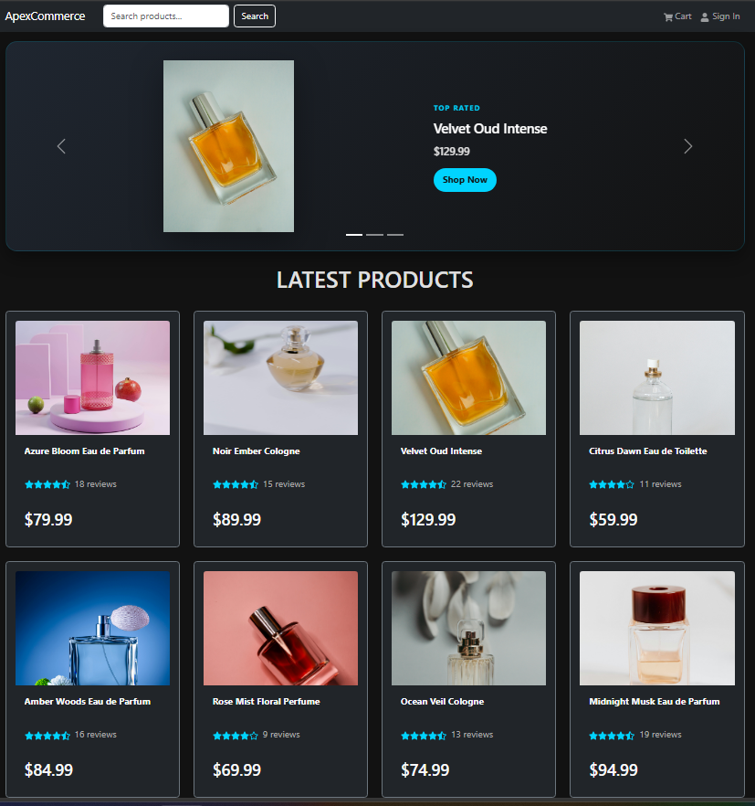
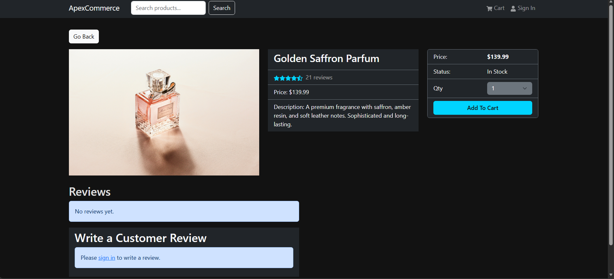
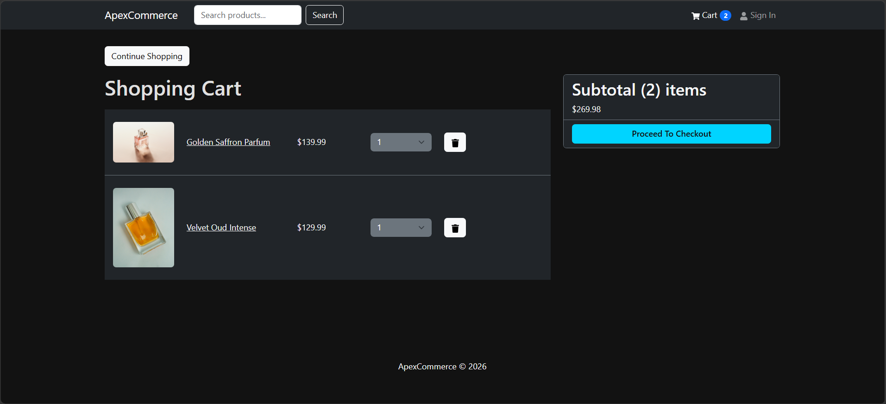
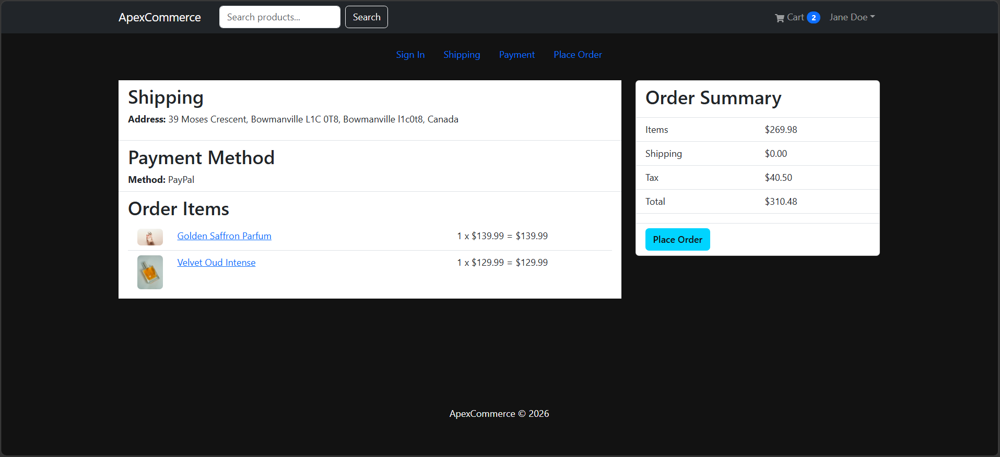
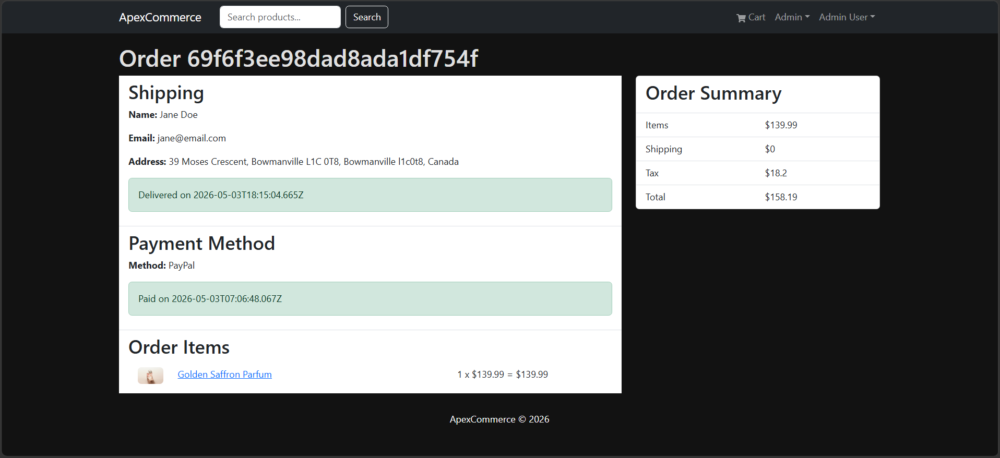
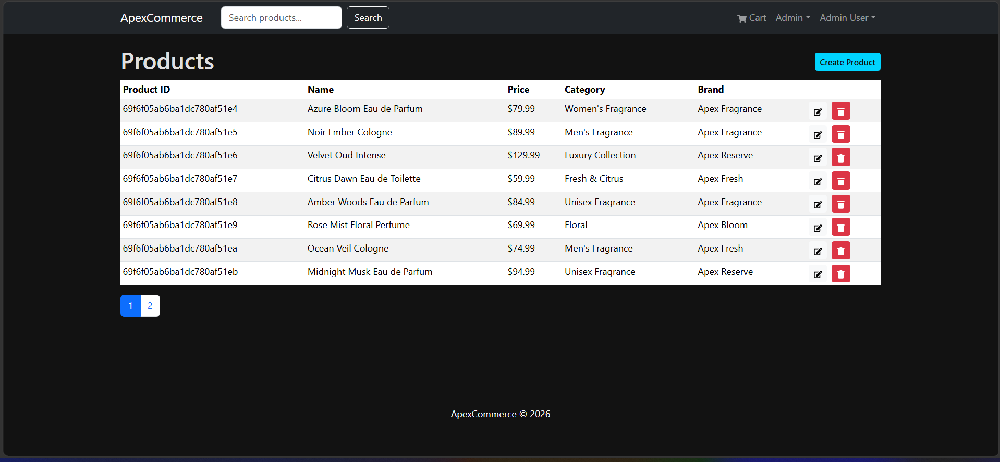
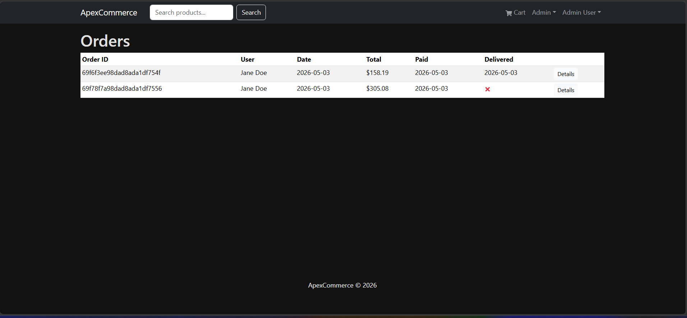
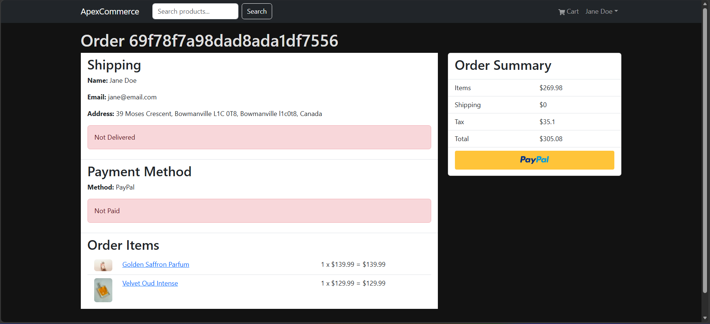
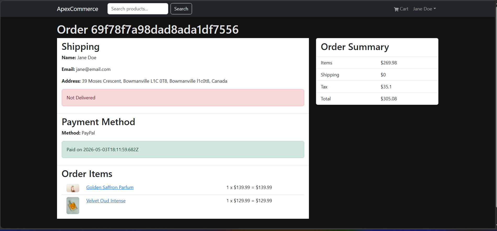
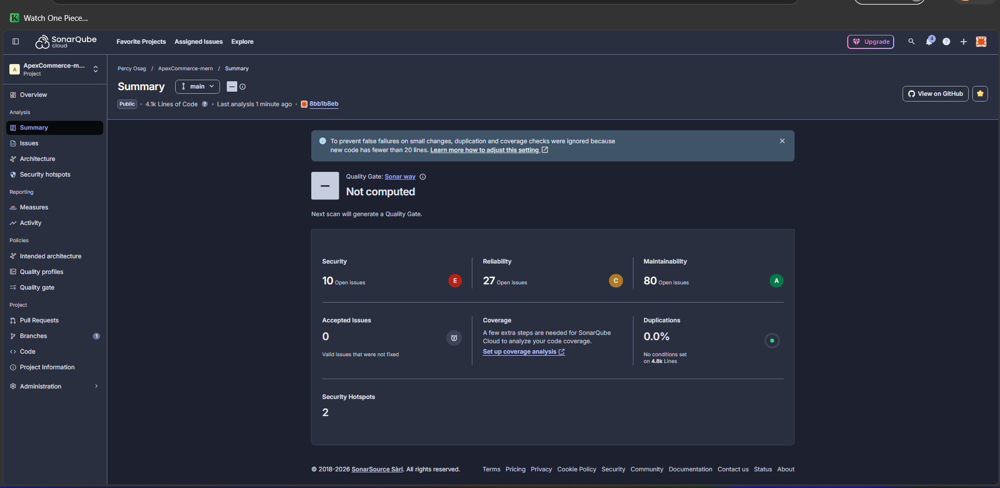

# ApexCommerce

ApexCommerce is a full-stack MERN ecommerce application built with React, Node.js, Express, MongoDB, Redux Toolkit, JWT authentication, and PayPal Sandbox payments.

The project follows a modern ecommerce workflow and extends it with cleaner backend validation, server-side PayPal capture, admin management features, milestone-based development, and SonarQube-friendly cleanup.

## Live Demo

Note: The backend is hosted on Render’s free tier, so the first request may take a few seconds to wake up.

- Frontend: https://apex-commerce-mern.vercel.app
- Backend API: https://apexcommerce-api.onrender.com/api/products

## Features

### Customer Features

- Browse products with search and pagination
- View product details, price, stock, ratings, and reviews
- Add products to cart and update quantities
- Continue shopping from the cart page
- Complete checkout with shipping, payment method, and order placement
- Pay using PayPal Sandbox with backend server-side capture
- View profile and order history
- Submit product reviews only after purchasing and paying for the product

### Admin Features

- View all orders
- Mark paid orders as delivered
- View, create, edit, delete, and paginate products
- Upload product images
- View all users
- Edit user details and admin status
- Delete non-admin users safely

## Tech Stack

### Frontend

- React
- Vite
- React Router
- Redux Toolkit
- RTK Query
- React Bootstrap
- React Toastify
- PayPal React SDK

### Backend

- Node.js
- Express
- MongoDB
- Mongoose
- JWT authentication with HTTP-only cookies
- Multer image uploads
- PayPal REST API server-side order creation and capture

## Key Technical Highlights

- Server-side PayPal order creation and capture for safer payment verification
- HTTP-only JWT cookie authentication
- Protected user routes and admin-only routes
- Centralized backend error handling
- Product validation for price, stock, and required fields
- Purchased-only product review rule
- Search and pagination support
- Admin product image upload
- Automatic frontend stale-session cleanup on 401 responses
- Milestone-based Git workflow with frequent testing and commits

## Project Status

The application has completed the main ecommerce build and passed full-flow regression testing, including:

- Public browsing
- Authentication
- Cart and checkout
- PayPal Sandbox payment
- Profile and order history
- Product reviews
- Admin order management
- Admin product management
- Admin user management
- Frontend linting

## Getting Started

### Prerequisites

- Node.js
- MongoDB Atlas or local MongoDB
- PayPal Sandbox developer account

### Backend Setup

```bash
cd backend
npm install
```

Create a `.env` file in the `backend` folder:

```env
NODE_ENV=development
PORT=5000
MONGO_URI=your_mongodb_connection_string
JWT_SECRET=your_jwt_secret
PAYPAL_CLIENT_ID=your_paypal_sandbox_client_id
PAYPAL_APP_SECRET=your_paypal_sandbox_secret
PAYPAL_API_URL=https://api-m.sandbox.paypal.com
```

Run the backend:

```bash
cd backend
npm run dev
```

### Frontend Setup

```bash
cd frontend
npm install
npm run dev
```

## Seed Data

To import seed data:

```bash
cd backend
npm run data:import
```

To destroy seed data:

```bash
cd backend
npm run data:destroy
```

## Testing Notes

The application was tested manually through the following flows:

- Login/logout and protected route access
- Product browsing, search, and pagination
- Cart add/remove/update quantity
- Checkout and PayPal Sandbox payment
- Profile order history
- Purchased-only review submission
- Admin order delivery workflow
- Admin product CRUD and image upload
- Admin user edit/delete workflow
- Frontend linting with ESLint

## Screenshots

### Home Page



### Product Details



### Cart Page



### Checkout Flow



### Order Summary



### Admin Product Management



### Admin Order Management



### PayPal Sandbox Payment



### PayPal-Paid Sandbox Payment



### SonarQube Cloud Quality Analysis



## Author

Percy Osunde
